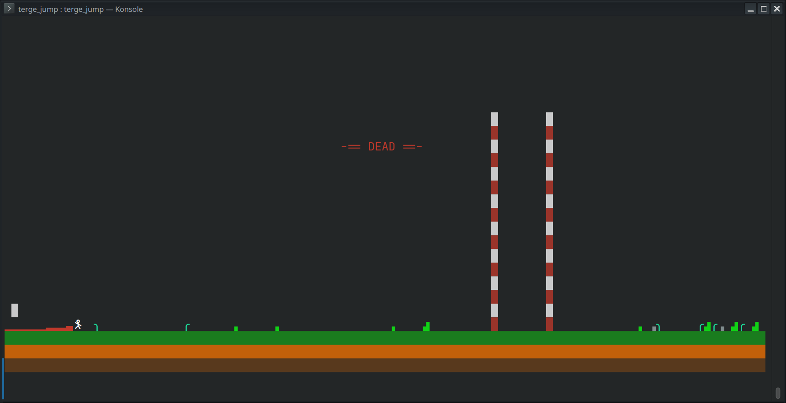

# Terminal Game Engine

This is a toy project of a terminal game engine. The intention is to provide a terminal framework to handle event loop and graphics. Due to the limitation of standard VT100 input handling key-release actions are not supported for most terminals.

Examples:

---

Bugs:
- jumper: if player has high speed the collision detector misses hits

Feature request:
-
